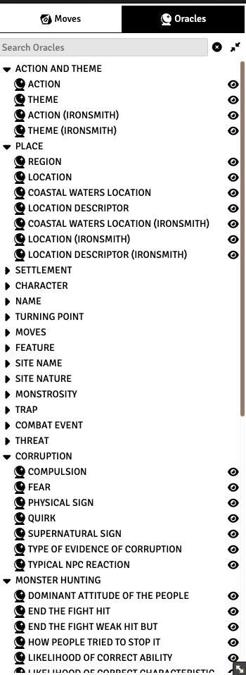
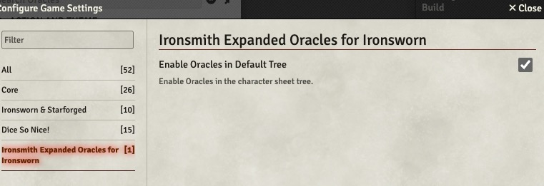
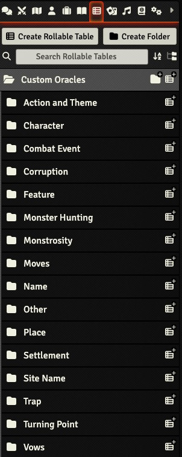
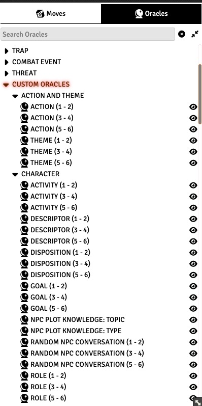

# ironsmith-expanded-oracles


[](https://github.com/jendave/ironsmith-expanded-oracles/releases/latest)

[](LICENSE)

# About
A FoundryVTT compendium of the [Ironsmith](https://preview.drivethrurpg.com/en/product/351813/ironsmith) and [Ironsmith Expanded Oracles](https://preview.drivethrurpg.com/en/product/333665/Ironsmith-Expanded-Oracles) supplements by Eric Bright.

# Contact
* [Ironsworn/Starforged Discord Server - FoundryVTT Channel](https://discord.com/channels/437120373436186625/867434336201605160)
* [GitHub Repository](https://github.com/jendave/ironsmith-expanded-oracles)

# Features and Notes
* Oracle tables from the PDF are included.
* Site/Delve Theme and Domain tables from the PDF are included.
* Tables that are copies of the Ironsworn official tables are included if they are part of Ironsmith 1-2, 3-4, 5-6 array.
* Tables that are simply copies of official Ironsworn tables without the array are not included since they would be redundant with the standard Ironsworn System tables.

# Module Installation
To install the module, search for `Ironsmith` or `Ironsworn` in the `Add-On Modules` tab of of the Foundry VTT game setup screen. Then click on `Install`.

Or use this URL and click on `Install`:

```
https://github.com/jendave/ironsmith-expanded-oracles/releases/latest/download/module.json
```

# Tabletop Integration
## Oracles
By default, the Oracles will be integrated into the Oracle Tree in the Character Sheet. 


If this is not desired, then uncheck the `Enable Oracles in Default Tree` in `Configure Settings` game settings. 


The Oracles can also be added to the character sheet by using the `Custom Folders` method below.

Macros for Dice rolling can be found in the `Ironsmith Expanded Oracles Macros` compendium. Drag and drop any you need into the macro toolbar.

## (Optional Installation) Use Custom Folders to add Character Sheet Oracles 
* If integrating the Ironsmith Oracles directly into the default Oracle Tree if not desired, then use this method to add the Ironsmith Oracles.
* If it does not already exist, create a `Custom Oracles` folder in `Rollable Tables` tab called:
  * `Custom Oracles` - EN
  * `Oráculos personalizados` - ES
  * `Oracles personnalisés` - FR
  * `Własne Wyrocznie` - PL
  * `Свои оракулы` - RU

Open the `Ironsmith Expanded Oracles` compendium and copy the folders into the `Rollable Tables` `Custom Oracles` folder.



The Oracles will be available in the Character sheet under `Custom Oracles`.



## Site Themes and Domains
Copy the desired themes and domains from the Ironsmith Site compendiums into the `Items` tab in FoundryVTT. 

# Credits
[Ironsmith](https://preview.drivethrurpg.com/en/product/351813/ironsmith) and [Ironsmith Expanded Oracles](https://preview.drivethrurpg.com/en/product/333665/Ironsmith-Expanded-Oracles) by Eric Bright are licensed for use under the [Creative Commons Attribution 4.0 International License (CC-BY)](https://creativecommons.org/licenses/by/4.0/).

Original oracles by Shawn Tomkin from [Ironsworn](https://preview.drivethrurpg.com/en/product/238369/ironsworn) and [Ironsworn: Delve](https://preview.drivethrurpg.com/en/product/302260/ironsworn-delve) are used under the [Creative Commons Attribution 4.0 International License (CC-BY)](https://creativecommons.org/licenses/by/4.0/).

Module by David Hudson and licensed for use under the [MIT license](https://opensource.org/license/mit/).

# Acknowledgements
Oracles were created using [Eric Bright's Ironsworn JSON files](https://github.com/ericbright2002/Forged_in_Obsidian).

Many thanks to Ben Straub for his fantastic [Ironsworn & Starforged Game System](https://foundryvtt.com/packages/foundry-ironsworn).

## Modules
The following modules were used in the development process
* [foundryvtt-importer module](https://github.com/EthanJWright/foundryvtt-importer)
* [DF Manual Rolls](https://foundryvtt.com/packages/df-manual-rolls)
